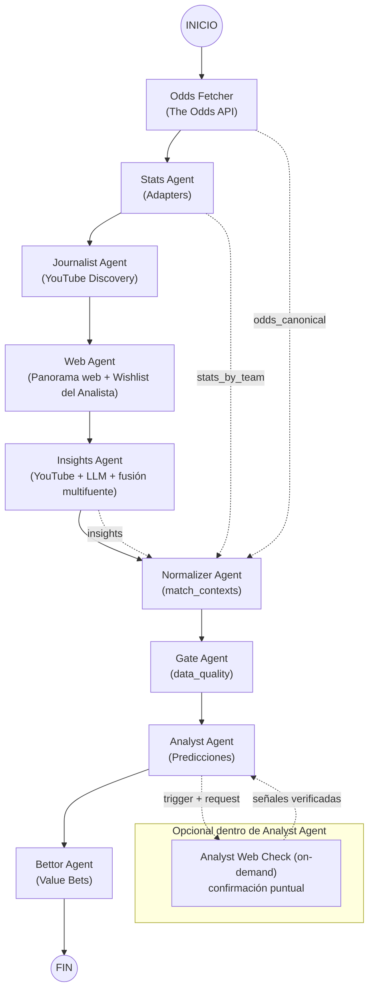
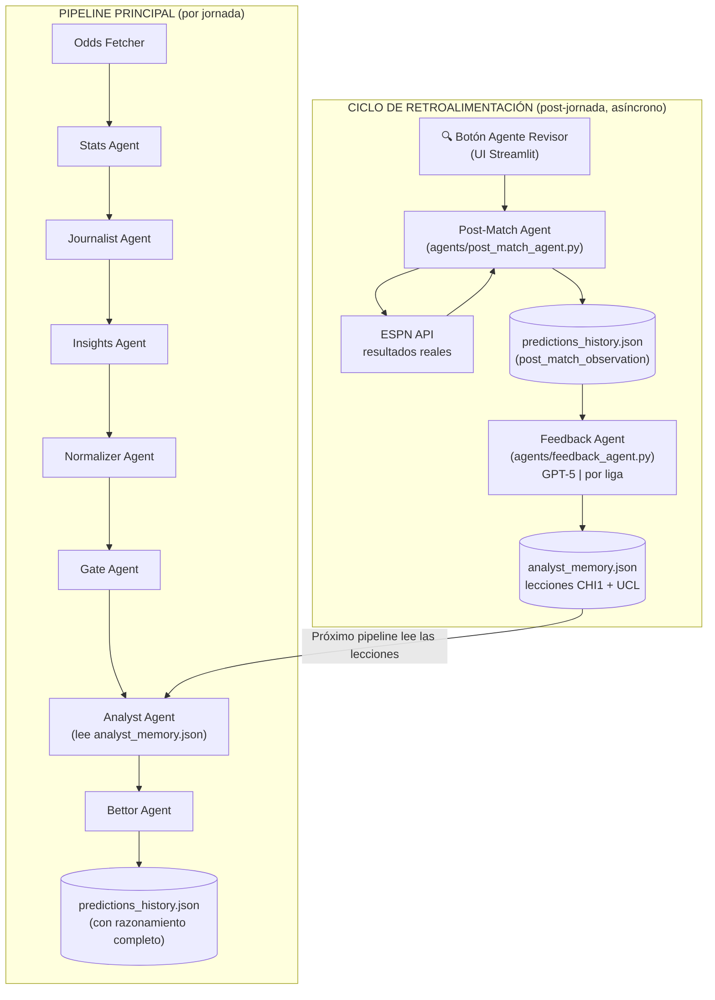

# Arquitectura Multi-Agente - EvaluaPro (Futbol)

Documento de referencia del flujo actual del sistema (pipeline + agentes auxiliares + persistencia + auditoría UI).

**Última actualización:** 2026-03-06

Este documento refleja el estado actual de la arquitectura, incluyendo:
- Flujo principal LangGraph
- Agente Web general (**siempre activo en el pipeline** — integrado con la Wishlist del Analista)
- Analyst Web Check on-demand (opcional dentro del Analyst Agent)
- Persistencias y archivos consumidos por Streamlit
- **Sistema de normalización de nombres de equipos (Golden Table)**

---

## Visión General

El sistema separa responsabilidades en capas:

1. `Datos base` (partidos, cuotas, stats)
2. `Contexto` (YouTube + Web + historial + noticias manuales)
3. `Consolidación` (match_contexts normalizados)
4. `Predicción` (analista)
5. `Decisión de apuesta` (bettor)

Principio clave:
- `Odds API` es la **fuente de verdad de partidos**.
- El resto de agentes **enriquecen** el contexto para esos partidos.

---

## Mapa del Flujo (Actual)



---

## Flujo de Estado (State) - Campos relevantes

Campos principales en `AgentState` (`state.py`):

- `competitions`
- `odds_canonical`
- `stats_by_team`
- `journalist_videos`
- `insights_sources`
- `insights`
- `match_contexts`
- `predictions`
- `betting_tips`
- `meta`

Campos auxiliares / opcionales recientes:
- `web_insights` (si se usa `web_agent_node` en pipeline)
- `analyst_web_checks` (resultado de verificaciones on-demand ejecutadas por el analista)

---

## Detalle por Agente (Pipeline Principal)

### 1. Odds Fetcher (Agente #1)

**Responsabilidad**
- Descubrir partidos y cuotas.
- Producir la lista base de eventos que gobierna el resto del pipeline.

**Fuente**
- `The Odds API` (v4)

**Input**
- `competitions` (configuración de UCL, CHI1, etc.)

**Output**
- `state["odds_canonical"]`

**Campos clave de salida**
- `competition`
- `match_key` (determinista; pilar de sincronización)
- `home_team`, `away_team`
- cuotas (`home_odds`, `draw_odds`, `away_odds`)
- `bookmakers_count`

> 💡 **Ejemplo (Colo-Colo vs Audax):**
> - `match`: Colo-Colo vs Audax Italiano
> - `odds`: 1.45 / 4.20 / 6.50
> - `match_key`: `CHI1:colo_colo:audax_italiano:2026-03-07`

**Notas**
- El `match_key` se usa para alinear `normalizer` y `analyst`.

---

### 2. Stats Agent (Agente #2)

**Responsabilidad**
- Enriquecer equipos con standings, forma y stats auxiliares.

**Arquitectura**
- Patrón Adapter (modular)

**Adapters (estado actual)**
- `ESPNAdapter` (activo)
- `FootballDataAdapter` (activo)
- `UefaAdapter` (placeholder / desarrollo)
- `FbrefAdapter` (placeholder / desarrollo)

**Input**
- Equipos derivados de `odds_canonical`

**Output**
- `state["stats_by_team"]`

> 💡 **Ejemplo (Colo-Colo vs Audax):**
> - `Colo-Colo`: Posición 1, Forma [W, W, W, D, W], Goles/partido: 2.1
> - `Audax`: Posición 12, Forma [L, D, L, W, L], Goles/partido: 0.9

**Notas**
- Usa normalización de nombres (`TeamNormalizer`)
- Persisten nombres originales + canónicos para trazabilidad

---

### 3. Journalist Agent (Agente #3)

**Responsabilidad**
- Descubrir videos relevantes de YouTube para contexto táctico / previo / noticias de equipo.

**Herramientas**
- `YouTube API v3`
- fallback con `yt-dlp`
- LLM para refinamiento final de candidatos

**Capacidades actuales relevantes**
- búsqueda por equipos/competencia
- whitelist de canales
- fallback de API key alternativa YouTube
- filtros negativos por competencia
- soporte multi-idioma (búsqueda en varios idiomas)
- logs enriquecidos (idiomas usados, fallback de key, prefiltro, etc.)

**Output**
- `state["journalist_videos"]`
- y puente a `state["insights_sources"]` para el Insights Agent

> 💡 **Ejemplo (Colo-Colo vs Audax):**
> - 📺 `TST`: "Colo-Colo prepara el XI ante Audax - ¿Almirón rota?"
> - 📺 `YouTube (ThonyBet)`: "Análisis táctico: Cómo Audax puede frenar al puntero"

**Persistencia / auditoría**
- `journalist_test_output.json` (usado por auditoría/inspección)

---

### 4. Web Agent (Agente Web general, **siempre activo en el pipeline** — AGW)

**Responsabilidad**
- Buscar panorama web actual por competencia/equipo para extraer contexto útil de predicción que no siempre aparece en YouTube.
- **Generar el Panorama General del Torneo** (`competition_summary`): quién es puntero, qué equipos están en crisis y qué tan determinante es la jornada.
- **Responder a la Wishlist del Analista**: atender dudas específicas (lesiones, xG, etc.) cargadas en `analyst_wishlist.json`.

**Modo de uso**
- **Siempre activo** dentro del pipeline (nodo fijo en la cadena: `journalist → web_agent → insights`)
- También disponible standalone (`run_web_agent.py`, pestaña Streamlit `Agente Web`)

**Herramientas**
- OpenAI Responses API + `web_search`

**Capacidades actuales**
- output JSON estructurado y validado
- sub-búsqueda focalizada en Contexto Táctico por competencia (`CHI1`, `UCL`)
- extracción de variables psicológicas (`aggregate_score`, `international_fatigue`, `extreme_venue`)
- reparación automática de JSON malformado
- segunda pasada por equipos faltantes
- equipos objetivo derivados de `pipeline_odds.json`
- **ventana de búsqueda: 5 días** (antes 48h/72h)
- fallback 14d disponible por flag (`WEB_AGENT_ENABLE_FALLBACK_14D=1`)

**🆕 Integración con la Wishlist del Analista (Generalizada)**

El analista cuenta con una **Wishlist Persistente** (`predictions/analyst_wishlist.json`) que define sus intereses y necesidades de búsqueda de forma independiente a la jornada actual. Ya no es necesario cargar preguntas partido a partido; el sistema las aplica de forma inteligente:

1.  **Intereses Globales**: Necesidades generales (ej: "Confirmar bajas de último minuto", "xG últimos 5 partidos") que no tienen equipos asociados. Se buscan para **todos** los equipos en cada jornada.
2.  **Intereses por Equipo**: Necesidades ligadas a equipos específicos (ej: "Estado de Octavio Rivero" para la U). Solo se inyectan en el prompt cuando el equipo afectado participa en la jornada.

El Web Agent procesa esta lista antes de iniciar la búsqueda y organiza el prompt para el LLM:

```
🌟 INTERESES GENERALES (Buscar para TODOS los equipos/partidos):
  🏥 [ALTA] Confirmar bajas de última hora, recuperaciones y suspensiones.
  🧠 [MEDIA] Alineaciones probables y posibles ajustes tácticos.

📌 NECESIDADES ESPECÍFICAS POR PARTIDO:
📅 PARTIDO: Colo-Colo vs Audax Italiano (2026-03-07)
  🏥 [ALTA] Colo-Colo: Confirmación de alineación (¿Aquino disponible?).
```

El LLM del Web Agent está instruido para responder a cada punto relevante en el campo `context_signals` de los equipos correspondientes.

**Categorías de la Wishlist**

| Ícono | Categoría  | Qué pide el analista                   |
|-------|------------|----------------------------------------|
| 🏥    | `injuries` | Lesiones, suspensiones, partes médicos |
| 🧠    | `tactical` | XI probable, esquema, rotaciones       |
| 📊    | `stats`    | xG, tiros, tendencia de goles          |
| 💰    | `market`   | Movimiento de cuotas, closing line     |
| 📋    | `context`  | Sede, motivación, clima, viajes        |
| ⚔️    | `h2h`      | Historial cara a cara                  |

**Código clave:** `agents/web_agent.py` → `_build_wishlist_block(fixtures)`

> 📂 **Ejemplo de Almacenamiento (`analyst_wishlist.json`):**
> Los requerimientos se guardan en un formato plano y persistente:
> ```json
> [
>   {
>     "need": "Confirmar si Octavio Rivero entrena normal por su esguince.",
>     "category": "injuries", "priority": "alta",
>     "teams_affected": ["Universidad de Chile"],
>     "added_at": "2026-03-06T16:28:55Z"
>   },
>   {
>     "need": "Movimientos de cuotas en las últimas 24h (closing line).",
>     "category": "market", "priority": "media",
>     "teams_affected": []
>   }
> ]
> ```
> *Nota: Se pueden agregar nuevos ítems desde la pestaña **Bitácora del Analista** en la UI.*

**Output (pipeline)**
- `state["web_insights"]` (cuando se usa el nodo)

> 💡 **Ejemplo (Colo-Colo vs Audax):**
> - `Noticias`: "Arturo Vidal duda por molestia muscular tras el entrenamiento".
> - `Wishlist Answer`: "Aquino entrena normal y será titular en Audax".

**Output (standalone file)**
- `web_agent_output.json`

**Campos relevantes por equipo**
- `competition_summary`: Resumen macro de la liga (líder, crisis, jornada clave).
- `web_insights`: Bullets detallados por equipo.
- `context_signals`: Señales para el analista (incluyendo respuestas a la wishlist).
- `sources`: URLs consultadas.
- `confidence`: Nivel de certeza.
- `as_of_date`: Fecha de los datos.

---


### 5. Insights Agent (Agente #4 / AG4)

**Responsabilidad**
- Transformar videos de YouTube en insights por equipo.
- Generar un **Análisis de Jornada** (`competition_analysis`) cruzando YouTube + Panorama Web.
- Fusionar señales de múltiples fuentes para entregar contexto útil al analista.

**Herramientas**
- transcripciones YouTube
- LLM batch (1 llamada por competencia)

**Inputs**
- `insights_sources` (videos seleccionados por Journalist)
- `odds_canonical` (equipos/partidos objetivo)
- `manual_news_input.json` (noticias manuales desde Streamlit)
- `web_agent_output.json` (para `competition_summary` y señales web)
- `team_history.json` (histórico persistido)

**Capacidades actuales (clave)**
- Prompt relajado (táctico + contexto + off-field)
- Alias/apodos de equipos (incluye CHI1)
- Detecta `context_signals`
- Soporta `is_rumor`
- Captura/infere fecha (`context_signals[].date`)
- Regla especial CHI1: `fecha/jornada` = ronda del torneo (no necesariamente fecha calendario)
- Pide contexto de personas (quién es, rol, importancia)

**Fusión multifuente actual en `insights_agent`**
- `YouTube + Web + Manual + History`
- Dedup por señal (`type + signal_normalized + date`)
- Merge de `provenance`, `confidence`, `evidence`, `date`

**Caducidad Inteligente (TTL) del Historial**
- Lee `team_history.json` pero intercepta la inyección filtrando por antigüedad (`ttl_days`).
- `international_fatigue`: Vence en 5 días.
- `heavy_rotation`: Vence en 4 días.
- `aggregate_score`: Vence en 8 días.
- Esto evita que el analista "recuerde" ruidos tácticos o físicos que ya expiraron.

**Control de ruido**
- poda de `history_signals` antes del analista (`INSIGHTS_MAX_HISTORY_SIGNALS_TO_ANALYST`, default `4`)

**Output**
- `state["insights"]` (cada insight incluye `competition_analysis` compartido por liga).

> 💡 **Ejemplo (Colo-Colo vs Audax):**
> - `Colo-Colo`: [`heavy_rotation`, `evidence`: "Almirón confirma suplentes", `provenance`: "youtube"]
> - `Colo-Colo`: [`medical_doubt`, `name`: "Vidal", `evidence`: "Duda por molestia", `provenance`: "web"]

**Persistencias**
- `youtube_insights_cache.json`
- `data/knowledge/team_history.json`

> **🆕 Canonización de claves en team_history.json**
>
> Antes, las claves del historial de equipos podían guardarse con el nombre que devolvía el LLM (ej: `"Concepción"`, `"la U"`, con mayúsculas o aliases). Esto podía provocar duplicados o que búsquedas futuras encontraran el equipo equivocado.
>
> Ahora, **antes de guardar cualquier insight en el historial**, se canoniza la clave usando el Golden Mapping:
> ```python
> canonical_key = normalizer_tool.clean(team) or team
> history[canonical_key] = ...
> ```
> Esto garantiza que `"Deportes Concepción"`, `"Dep Concepcion"` y `"el conce"` siempre apunten a la misma clave: `"deportes concepción"`.

---


### 6. Normalizer Agent (Agente #5 / AG5)

**Responsabilidad**
- Consolidar datos por partido en una estructura única (`match_contexts`).
- Unificar odds + stats + insights en payload listo para analista.

**Herramientas**
- `TeamNormalizer` (Golden Table + fuzzy matching conservador)
- `_is_blacklisted_match` — guardia dura contra matches cruzados entre equipos similares

**Input**
- `odds_canonical`
- `stats_by_team`
- `insights`
- `team_history.json` (merge de histórico persistido)

**Output**
- `state["match_contexts"]`
- persistido en `pipeline_match_contexts.json`

> 💡 **Ejemplo (Colo-Colo vs Audax):**
> - `match_id`: `CHI1:2026-03-07:colo_colo:audax`
> - `odds`: [1.45, 4.20, 6.50]
> - `stats`: [Colo-Colo (3.5/5), Audax (2/5)]
> - `insights`: 4 señales críticas consolidadas (Vidal duda, Rotación, Aquino OK).

**Capacidades actuales relevantes**
- usa `match_key` como prioridad
- `match_id` canónico estable
- merge de histórico persistido a `context_signals`
- por defecto **NO** infla el texto `insight` con histórico (`NORMALIZER_MAX_HISTORY_BULLETS_IN_INSIGHT=0`)
- añade `provenance=["history"]` al histórico inyectado
- **🆕 Guardia de blacklist en búsqueda de historial:** antes de comparar equipos por fuzzy matching, verifica que el par no sea una combinación conocida como conflictiva (ej: U. de Concepción vs Deportes Concepción). Evita que histórico de un equipo "se filtre" al equipo equivocado.

---


### 6.5 Gate Agent (Agente #5.5 / AG55)

**Responsabilidad**
- Filtrar / marcar calidad de datos antes de que llegue al analista.

**Output**
- `match_contexts` enriquecidos con `data_quality`

> 💡 **Ejemplo (Colo-Colo vs Audax):**
> - `score`: 4.5 / 5.0
> - `notes`: "Fuentes variadas confirmando rotación, confianza alta."

**Campos típicos**
- `score`
- `notes`

**Uso en UI**
- `Rastreo de Agentes` muestra `Data Quality Score` y observaciones

---

### 7. Analyst Agent (Agente #6 / AG6)

**Responsabilidad**
- Generar predicciones 1X2, confianza, score estimado y factores.
- **Consumir el Panorama General:** Ajustar su sesgo predictivo según la urgencia de puntos (ej: "equipo X debe ganar para no salir de zona de copas").
- **Aprender de Lecciones Pasadas:** Consultar `analyst_memory.json` para evitar repetir errores o considerar patrones de liga.

**Herramientas**
- LLM (actualmente OpenAI GPT-5 en batch por competencia)
- `Analyst Web Check` (opcional, on-demand, acotado)

**Inputs**
- `match_contexts` (preferencia)
- fallback legacy con `fixtures`, `stats`, `insights`, `odds`

> 📂 **Ejemplo Extenso de Input (match_context) para el Analista:**
>
> Este es el objeto consolidado que el Analista recibe para procesar un partido:
> ```json
> {
>   "match_id": "CHI1:2026-03-07:colo_colo:audax",
>   "match_key": "CHI1:colo_colo:audax_italiano:2026-03-07",
>   "home_team": "Colo-Colo",
>   "away_team": "Audax Italiano",
>   "competition": "CHI1",
>   "competition_analysis": "Colo-Colo es puntero absoluto con 5 pts de ventaja. Esta jornada es vital para Audax (en zona de descenso) tras la victoria ayer de Copiapó.",
>   "odds": {
>     "home_odds": 1.45, "draw_odds": 4.20, "away_odds": 6.50
>   },
>   "stats": {
>     "home": {"position": 1, "form": ["W", "W", "W", "D", "W"], "goals_per_match": 2.1},
>     "away": {"position": 12, "form": ["L", "D", "L", "W", "L"], "goals_per_match": 0.9}
>   },
>   "insights": "Colo-Colo viene con rotación masiva tras Libertadores. Audax recupera a su central titular.",
>   "context_signals": [
>     {
>       "type": "heavy_rotation",
>       "team": "Colo-Colo",
>       "signal": "Almirón confirma 8 suplentes en el XI inicial",
>       "provenance": "youtube",
>       "confidence": 0.9,
>       "date": "2026-03-06"
>     },
>     {
>       "type": "medical_doubt",
>       "team": "Colo-Colo",
>       "signal": "Arturo Vidal duda por molestia muscular",
>       "provenance": "web",
>       "confidence": 0.7,
>       "is_rumor": true,
>       "date": "2026-03-06"
>     },
>     {
>       "type": "medical_ok",
>       "team": "Audax Italiano",
>       "signal": "Aquino entrena normal y será titular",
>       "provenance": "web",
>       "confidence": 1.0,
>       "date": "2026-03-06"
>     },
>     {
>       "type": "history",
>       "team": "Colo-Colo",
>       "signal": "Sufrió para ganar a Palestino con rotación previa",
>       "provenance": "history",
>       "date": "2026-02-28"
>     }
>   ],
>   "data_quality": {
>     "score": 4.5,
>     "notes": "Fuentes variadas y consistentes. Wishlist respondida."
>   }
> }
> ```

**Capacidades actuales relevantes**
- prioriza `match_contexts` por `match_key`
- prompt con:
  - ponderación temporal
  - ponderación por fuente (`youtube/web/history/manual`)
  - penalización de rumores
  - criterio experto (ponderaciones referenciales, no absolutas)
  - mención explícita de `analyst_web_check` cuando exista

**Analyst Web Check (on-demand dentro del analista)**
- Habilitación por flag: `ENABLE_ANALYST_WEB_CHECK=1`
- Trigger normal: señales críticas con rumor/incertidumbre o sin corroboración
- Modo prueba controlado:
  - `ANALYST_WEB_CHECK_FORCE_TEST=1`
  - `ANALYST_WEB_CHECK_DISABLE_NORMAL_TRIGGER=1`
- `lookback` configurable: `ANALYST_WEB_CHECK_LOOKBACK_DAYS=7`

> 🔄 **Dinámica de la Herramienta (Analyst Web Check):**
>
> 1. **Input (El Analista dispara el gatillo):** Al detectar una señal con `is_rumor: true` o falta de evidencia, el Analista envía una solicitud:
>    ```json
>    {
>      "match_id": "...", 
>      "queries": [
>        {"query": "¿Arturo Vidal está lesionado?", "reason": "Señal previa marca duda muscular con confianza 0.7"}
>      ]
>    }
>    ```
> 2. **Output (La herramienta devuelve señales limpias):** Tras buscar en la web, el motor devuelve:
>    ```json
>    {
>      "status": "confirmed_negative",
>      "answer_summary": "Vidal entrenó normal y Almirón lo confirmó para el XI.",
>      "context_signals": [
>        {"type": "medical_ok", "team": "Colo-Colo", "signal": "Vidal al 100% confirma el DT", "confidence": 0.95}
>      ]
>    }
>    ```

**Output**
- `state["predictions"]`
- `state["analyst_web_checks"]` (lista de checks ejecutados)

> - `prediction`: 1 (Gana Colo-Colo)
> - `confidence`: 61%
> - `predicted_score`: "2-1"
> - `reasoning`: "Pese a la rotación, el volumen ofensivo de Colo-Colo ante un Audax débil defensivamente justifica el favoritismo."
>
> 📂 **Ejemplo de Salida (JSON) del Analyst Agent:**
> ```json
> {
>   "match_id": "CHI1:2026-03-07:colo_colo:audax",
>   "prediction": "1",
>   "confidence": 0.61,
>   "predicted_score": "2-1",
>   "reasoning": "Pese a la rotación, el volumen ofensivo de Colo-Colo ante un Audax...",
>   "key_factors": [
>     "Rotación masiva de Colo-Colo",
>     "Mejora defensiva de Audax (Aquino)",
>     "Localía favorable"
>   ]
> }
> ```

**Persistencias**
- `pipeline_predictions.json`
- `pipeline_analyst_web_checks.json`

---

### 8. Bettor Agent (Agente #7 / AG7)

**Responsabilidad**
- Convertir predicciones en apuestas con valor esperado (EV).

**Inputs**
- `predictions`
- cuotas de `odds_canonical`

**Output**
- `state["betting_tips"]`
- persistido en `pipeline_bets.json`

> 💡 **Ejemplo (Colo-Colo vs Audax):**
> - `action`: "Skip / No Value"
> - `rationale`: "Cuota de 1.45 es demasiado baja para el riesgo de rotación. Se requiere cuota >1.65 para que valga la pena."

**Criterios**
- edge vs mercado
- stake (Kelly / lógica de riesgo)
- racional de apuesta

---

## Analyst Web Check (Módulo Standalone) - Detalle

### Objetivo
Verificar información puntual para el analista, por ejemplo:
- lesión/duda médica
- suspensión / expulsión / castigo
- castigo de localía
- referencia contextual de jugador/persona (rol/importancia)

> 📂 **Ejemplo de Salida (JSON) de Analyst Web Check:**
> ```json
> {
>   "ok": true,
>   "checks": [
>     {
>       "question": "¿Arturo Vidal está lesionado para el partido contra Audax?",
>       "status": "confirmed_negative",
>       "answer_summary": "Vidal entrenó con normalidad hoy. El DT Almirón confirmó que está al 100% pero podría ser reservado por precaución.",
>       "context_signals": [
>         {
>           "type": "medical_ok",
>           "team": "Colo-Colo",
>           "signal": "Vidal entrenó normal, descartada lesión grave",
>           "provenance": "analyst_web_check",
>           "confidence": 0.95,
>           "date": "2026-03-06"
>         }
>       ],
>       "sources": ["https://espn.cl/futbol/...", "https://alairelibre.cl/..."]
>     }
>   ]
> }
> ```

### Qué NO hace
- No reemplaza al Agente Web general
- No hace panorama de competencia (esto lo hace el Agente Web en el flujo normal)

---

## Memoria del Sistema: El Flujo de la Información Persistente

El pipeline de EvaluaPro ya no analiza cada jornada "desde cero". Se ha implementado un sistema de **Memoria y Persistencia** compuesto por tres archivos críticos. Cada uno tiene un rol específico y entra al pipeline en diferentes etapas para alimentar finalmente al Analista.

### 1. `analyst_wishlist.json` (Intereses Estructurales)
- **Dónde entra:** En el **Web Agent** (Agente #4).
- **Qué contiene:** Necesidades de búsqueda del analista. Pueden ser GLOBALES (ej: "Buscar cambios de cuotas de último minuto") o ESPECÍFICAS por equipo (ej: "¿Entrenó normal Arturo Vidal?").
- **Cómo fluye:** El Web Agent lee esta lista antes de buscar. Luego, inyecta las respuestas directamente en el campo `context_signals` del payload bajo `web_insights`. Esto asegura que el Analista reciba las respuestas exactas que solicitó sin tener que buscar él mismo.

### 2. `team_history.json` (Memoria a Corto Plazo / Contexto Físico)
- **Dónde entra:** En el **Insights Agent** y el **Normalizer Agent**.
- **Qué contiene:** Señales persistentes pasadas que aún tienen impacto (Ej: Fatiga por jugar Copa Libertadores hace 3 días, rachas muy pesadas, o expulsiones previas).
- **Cómo fluye:** El sistema lee este archivo y filtra por TTL (Time To Live). Si una señal no ha caducado (ej: `international_fatigue` dura 5 días), el Normalizer la inyecta como un `context_signal` con `provenance: "history"`. El Analista pondera esta señal junto con las noticias nuevas. **Novedad:** Ahora las claves de los equipos se canonizan usando la Golden Table antes de guardarse, evitando historiales duplicados.

### 3. `analyst_memory.json` (Lecciones Aprendidas / Memoria a Largo Plazo)
- **Dónde entra:** Directamente en el **Analyst Agent**.
- **Qué contiene:** Reglas heurísticas y patrones estructurales descubiertos por el Agente Evaluador/Feedback Agent tras analizar predicciones pasadas (Ej: "La localía en altura pesa más en partidos de martes").
- **Cómo fluye:** Al iniciar su razonamiento, el Analista carga este archivo y filtra las lecciones que corresponden a la competencia actual ( CHI1, UCL). Inserta una sección `LECCIONES APRENDIDAS` en su prompt. Si el Analista nota que el partido cumple con los patrones de una lección, utilizará esa regla para ajustar su predicción o confianza, evitando los mismos errores del pasado.

### Resumen del Ecosistema de Archivos Auxiliares

| Archivo | Agente Consumidor | Propósito General |
| :--- | :--- | :--- |
| `chi1_golden_mapping.json` | **Normalizer / Insights** | Filtro primario (Golden Table) para evitar confusión entre equipos con nombres similares. |
| `manual_news_input.json` | **Insights Agent** | Inyecta noticias de último minuto ingresadas manualmente vía UI. |
| `youtube_insights_cache.json`| **Insights Agent** | Caché para ahorrar cuota de LLM y tiempo. |

### Archivos
- `agents/analyst_web_check.py`
- `run_analyst_web_check.py`

### Contrato de salida (resumen)
- `ok`
- `data.checks[]`
  - `question`
  - `status`
  - `answer_summary`
  - `context_signals[]`
  - `sources[]`
- `validation_errors`
- `raw_text`

### UI
`Rastreo de Agentes` muestra bloque:
- `1.5 Verificación Web del Analista (On-demand)`

Incluye:
- trigger
- preguntas
- señales confirmadas
- fuentes
- payload completo del check

---

## Streamlit - Pestañas relevantes para auditoría

### `Rastreo de Agentes`
Vista paso a paso por partido:
- Odds
- Gate score
- Stats por equipo
- Insights por equipo (payload real)
- `context_signals` con `provenance`, fecha, rumor
- `Analyst Web Check` (si existe)
- Predicción
- Apuesta

### `Insights Persistentes`
Fuente:
- `data/knowledge/team_history.json`

Filtros:
- equipo
- competencia
- tipo (`insight` / `context_signal`)
- buscador

### `Agente Web`
Permite ejecutar el `Web Agent` standalone y ver:
- resumen por competencia
- detalle por equipo
- JSON completo
- `coverage_meta`
- `subcall_errors`

### `Logs`
Lee logs desde disco (fuente de verdad) con buffer ampliado y buscador.

---

## Agente Revisor / Evaluador (Standalone, fuera del pipeline principal)

### Rol
Evalúa predicciones históricas contra resultados reales una vez finalizados los partidos.

### Estado arquitectónico
- **No está integrado** al pipeline LangGraph principal (a propósito).
- Corre como proceso separado para no bloquear ni contaminar el pipeline de predicción.

### Archivos
- `agents/evaluator_agent.py`
- `run_evaluator.py`

### Qué hace
- Lee historial de predicciones: `predictions/predictions_history.json`
- Consulta resultados reales en ESPN (`ESPNAPI`)
- Empareja partidos (normalización + fallback LLM si hace falta)
- Marca:
  - `actual_score`
  - `result`
  - `correct`
  - `evaluation_status`
- Genera reportes:
  - `predictions/evaluation_summary.json`
  - `predictions/evaluation_summary.csv`
  - actualiza historial evaluado

### UI (Streamlit)
En la pestaña `Evaluación de Rendimiento` existe botón explícito:
- `🔎 Ejecutar Agente Revisor (Standalone)`

Esto permite aislarlo del pipeline principal y correrlo bajo demanda.

---

## Persistencia y Archivos Clave (Actual)

### Salidas principales del pipeline
- `pipeline_result.json`
- `pipeline_metadata.json`
- `pipeline_fixtures.json`
- `pipeline_odds.json`
- `pipeline_stats.json`
- `pipeline_insights.json`
- `pipeline_match_contexts.json`
- `pipeline_predictions.json`
- `pipeline_bets.json`
- `pipeline_analyst_web_checks.json` (nuevo)

### Persistencias auxiliares
- `youtube_insights_cache.json`
- `data/knowledge/team_history.json`
- `data/inputs/manual_news_input.json`
- `web_agent_output.json`
- `journalist_test_output.json`
- `predictions/predictions_history.json`
- `predictions/evaluation_summary.json`
- `predictions/evaluation_summary.csv`

### Logs
- `pipeline_last_run.log`
- `pipeline_partial_last_run.log`

---

## Flags / Variables de Entorno Relevantes (Resumen Operativo)

### Web Agent (general)
- **Siempre activo en el pipeline**
- `WEB_AGENT_LOOKBACK_DAYS=7`
- `WEB_AGENT_ENABLE_FALLBACK_14D=0|1`
- `WEB_AGENT_FALLBACK_LOOKBACK_DAYS=14`
- `WEB_AGENT_MODEL=gpt-4.1`

### Analyst Web Check
- `ENABLE_ANALYST_WEB_CHECK=1`
- `ANALYST_WEB_CHECK_LOOKBACK_DAYS=7`
- `ANALYST_WEB_CHECK_FORCE_TEST=1` (solo pruebas)
- `ANALYST_WEB_CHECK_DISABLE_NORMAL_TRIGGER=1` (solo pruebas)
- `ANALYST_WEB_CHECK_MODEL=gpt-4.1`

### Insights / Normalizer / Analyst
- `INSIGHTS_MAX_HISTORY_SIGNALS_TO_ANALYST=4`
- `NORMALIZER_MAX_HISTORY_BULLETS_IN_INSIGHT=0`
- `ANALYST_STALE_CONTEXT_DAYS=14`

---

## Sistema de Normalización de Nombres de Equipos

> 📌 **Por qué importa esto:** El fútbol chileno tiene equipos con nombres muy similares. Sin un sistema robusto, el pipeline puede confundirlos y entregar al analista información de un equipo equivocado — por ejemplo, asignar noticias de Joaquín Larrivey (Deportes Concepción) al partido de Universidad de Concepción.

### Los 5 Equipos Más Conflictivos

| Equipo A | Equipo B | Por qué se confunden |
|---|---|---|
| Universidad de Chile | Universidad Católica | Ambas son "universidades" |
| Universidad de Concepción | Deportes Concepción | Ambas tienen "Concepción" |
| Universidad de Concepción | Universidad de Chile | Ambas son "universidades" |
| Deportes Concepción | Deportes Limache | Ambas son "Deportes" |
| "conce" / "concepcion" solo | cualquier U. de Concepción | Alias ambiguo |

### Capas del Sistema (de mayor a menor prioridad)

#### Capa 1 — Golden Table (`utils/chi1_golden_mapping.json`)

Es la **fuente de verdad absoluta**. Un archivo JSON que mapea cada equipo oficial a todos sus aliases conocidos (apodos, variaciones con acentos, nombres coloquiales, etc.). El sistema consulta esta tabla *antes* que cualquier otra lógica.

**Ejemplo de entrada en la Golden Table:**
```json
{
  "canonical_name": "deportes concepción",
  "aliases": ["conce", "el conce", "concepcion", "dep concepcion", "léon de collao"]
}
```

Cuando el sistema recibe el alias `"el conce"`, lo resuelve inmediatamente a `"deportes concepción"` y **nunca** lo confunde con `"universidad de concepción"`.

**Aliases más importantes configurados (actualizados en 2026-03-06):**

| Equipo | Cómo lo llaman popularmente |
|---|---|
| **Universidad de Concepción** | `"la u de conce"`, `"u de conce"`, `"el campanil"`, `"campaneros"`, `"udc"` |
| **Deportes Concepción** | `"conce"`, `"el conce"`, `"concepcion"`, `"dep concepcion"` |

> ⚠️ Nota: `"concepcion"` a secas siempre apunta a **Deportes** Concepción. El equipo de Universidad de Concepción se llama `"la u de conce"` o `"el campanil"`, **nunca** solo `"el conce"`.

#### Capa 2 — Blacklist de Pares Prohibidos (`_is_blacklisted_match`)

Función en `agents/normalizer_agent.py` que define **qué pares de equipos jamás deben considerarse el mismo equipo**, sin importar qué tan parecidos sean sus nombres. Se ejecuta **antes** del matching difuso.

Lo más importante: evalúa tanto el nombre original como el nombre **canónico** (post-Golden Table) para capturar aliases indirectos. Por ejemplo:
- `"u concepcion"` → Golden Table lo resuelve a `"universidad de concepcion"` → el blacklist bloquea el match con `"deportes concepcion"`.

**Las 4 Reglas del Blacklist:**

| # | Regla | Qué bloquea |
|---|---|---|
| 1 | U. de Concepción ↔ Deportes Concepción | Cualquier combinación de aliases de ambos |
| 2 | `"concepcion"`/`"conce"` solo ↔ cualquier universidad | Alias desnudo confuso vs universidades |
| 3 | Universidad ↔ Universidad | U. Chile, U. Católica y U. Concepción son siempre distintas entre sí |
| 4 | Deportes Limache ↔ Deportes Concepción | Siempre distintos aunque ambos sean "Deportes" |

#### Capa 3 — Fuzzy Matching Conservador

Solo se activa *después* de que el blacklist haya aprobado la comparación. Usa 4 estrategias en orden:

1. **Substring de slugs**: ¿está uno dentro del otro?
2. **Soft-Jaccard de tokens**: ¿cuántos tokens significativos comparten?
3. **Subset containment**: ¿todos los tokens del nombre corto están en el nombre largo?
4. **Token largo compartido**: ¿comparten al menos un token de ≥7 caracteres no ambiguo?

Tokens marcados como **ambiguos** (no sirven por sí solos): `"madrid"`, `"concepcion"`, `"deportes"`, `"deportivo"`, `"universidad"`.

### Flujo de Decisión Completo

```
¿Son el mismo equipo?
  │
  ▼
1. Golden Table → ¿mismo canonical_name? → SÍ ✅ MATCH
  │ NO
  ▼
2. Blacklist → ¿par conflictivo conocido? → SÍ ❌ NO MATCH
  │ OK (no bloqueado)
  ▼
3. Substring → ¿uno contiene al otro? → SÍ ✅ MATCH
  │ NO
  ▼
4. Jaccard ≥ 0.6 → ✅ MATCH / NO → continuar
  │
  ▼
5. Subset containment → ✅ / NO → continuar
  │
  ▼
6. Token largo compartido → ✅ / NO ❌ NO MATCH
```

### Verificación Rápida (13 tests)

Para verificar que el sistema funciona correctamente:

```bash
cd c:\desarrollos\apuestas\Futbol
python test_validation.py
```

Resultado esperado: **13/13 PASS** ✅

---

## Estado Actual / Notas de Diseño


### Lo que ya está fuerte
- `provenance` trazable (`youtube`, `web`, `manual`, `history`, `analyst_web_check`)
- `Rastreo` muy auditables
- fusión multifuente en `insights_agent`
- `Analyst Web Check` acotado y opcional

### Pendientes vigentes (arquitectura)
- Afinar trigger normal del `Analyst Web Check` con datos reales de varias corridas
- Ponderación por fuente/recencia más fina (prompt + eventualmente heurística)
- Refactor futuro (nice to have): backend pluggable del analista (`OpenAI / Gemini / ...`) con contrato estable

---

## Resumen de Filosofía de Arquitectura

- `Agente Web` (general) = **panorama amplio**
- `Insights Agent` = **fusión semántica + contexto por equipo**
- `Normalizer` = **consolidación mecánica por partido**
- `Analyst Web Check` = **confirmación puntual on-demand**
- `Analyst Agent` = **decisor experto con criterio**

Esto permite crecer sin mezclar responsabilidades y mantiene la auditoría visible en Streamlit.

---

## Cheat Sheet Operativo (Rápido)

### 1) Modo Producción (recomendado)

Usar cuando quieres correr el flujo con comportamiento estable y costo controlado.

```env
WEB_AGENT_LOOKBACK_DAYS=7
WEB_AGENT_ENABLE_FALLBACK_14D=0

ENABLE_ANALYST_WEB_CHECK=1
ANALYST_WEB_CHECK_LOOKBACK_DAYS=7
ANALYST_WEB_CHECK_FORCE_TEST=0
ANALYST_WEB_CHECK_DISABLE_NORMAL_TRIGGER=0

NORMALIZER_MAX_HISTORY_BULLETS_IN_INSIGHT=0
INSIGHTS_MAX_HISTORY_SIGNALS_TO_ANALYST=4
ANALYST_STALE_CONTEXT_DAYS=14
```

### 2) Modo Test Controlado (validar UI / flujo de Analyst Web Check)

Usar cuando quieres forzar 1 verificación web del analista para revisar `Rastreo`, sin depender del trigger real.

```env
ENABLE_ANALYST_WEB_CHECK=1
ANALYST_WEB_CHECK_LOOKBACK_DAYS=7
ANALYST_WEB_CHECK_FORCE_TEST=1
ANALYST_WEB_CHECK_DISABLE_NORMAL_TRIGGER=1
```

Qué esperar:
- se ejecuta **1 solo** `Analyst Web Check` en la corrida
- aparece bloque `1.5 Verificación Web del Analista (On-demand)` en `Rastreo`

### 3) Modo Debug Trigger (ajustar gatillo real del Analyst Web Check)

Usar cuando quieres observar cuándo dispara el trigger normal y si está demasiado agresivo o demasiado estricto.

```env
ENABLE_ANALYST_WEB_CHECK=1
ANALYST_WEB_CHECK_LOOKBACK_DAYS=7
ANALYST_WEB_CHECK_FORCE_TEST=0
ANALYST_WEB_CHECK_DISABLE_NORMAL_TRIGGER=0
```

Revisar en logs:
- `Analyst Web Check habilitado...`
- `Analyst Web Check aplicado para ...`
- cantidad de checks por competencia/partido

### 4) Modo Web Agent Standalone (investigación / tuning)

Usar para probar calidad/cobertura del `Agente Web` sin afectar el pipeline.

```env
WEB_AGENT_LOOKBACK_DAYS=7
WEB_AGENT_ENABLE_FALLBACK_14D=0
WEB_AGENT_MODEL=gpt-4.1
```

Ejecutar desde:
- pestaña `Agente Web` (Streamlit), o
- `python run_web_agent.py`

### 5) Después de una prueba con FORCE TEST (importante)

Volver a modo normal para no contaminar resultados:

```env
ANALYST_WEB_CHECK_FORCE_TEST=0
ANALYST_WEB_CHECK_DISABLE_NORMAL_TRIGGER=0
```

---

## Ciclo de Retroalimentación y Mejora Continua (2026-03-02)

Sistema de **mejora continua automática** implementado sobre el pipeline principal.
Opera de forma **asíncrona e independiente** — se gatilla desde la UI, no desde el pipeline.

### Flujo del Ciclo Completo



### Agentes del Ciclo de Retroalimentación

#### `post_match_agent.py` (Post-Match Agent)
- **Cuándo**: después de cada jornada, asíncrono vía botón UI
- **Qué hace**: lee predicciones pendientes → consulta ESPN → genera `post_match_observation`
- **Tipos de error** estandarizados:
  - `correct` — predicción correcta ✅
  - `draw_missed` — predijo 1 o 2, fue empate
  - `home_bias` — predijo local sin razón, ganó visitante
  - `overconfident_wrong` — confianza > 65%, resultado incorrecto
  - `market_divergence_loss` — se apartó del mercado y perdió
  - `market_alignment_loss` — siguió al mercado y aun así perdió
  - `data_poverty_miss` — falló con datos de baja calidad (pos=99)

#### `feedback_agent.py` (Feedback Agent)
- **Cuándo**: inmediatamente después del Post-Match Agent
- **Qué hace**: calcula estadísticas por liga → genera lecciones con **GPT-5** → guarda `analyst_memory.json`
- **Lecciones separadas** por CHI1 y UCL
- **Salida**: `predictions/analyst_memory.json`

#### Integración en Analyst Agent
- Funciones nuevas: `_load_analyst_memory()` y `_format_memory_section()`
- El prompt recibe sección `LECCIONES APRENDIDAS DE PARTIDOS {LIGA} PASADOS` antes de responder
- Cada lección incluye: patrón, severidad (alta/media/baja), descripción y regla accionable

### UI — Pestaña "🤖 Memoria del Analista"
- Botón `🔍 Ejecutar Agente Revisor` → threading asíncrono (no bloquea la UI)
- Log en vivo del progreso en session_state
- Visualización de métricas, distribución de errores y lecciones por liga en sub-tabs
- Lección Maestra y nota de Calibración globales

### Archivos persistentes
| Archivo | Owner | Descripción |
|---|---|---|
| `predictions/predictions_history.json` | Analyst + Post-Match | Historial completo con razonamiento y observaciones |
| `predictions/analyst_memory.json` | Feedback Agent | Lecciones aprendidas por liga, consumidas por el Analyst |
| `predictions/evaluation_summary.json` | Post-Match | Resumen de precisión por liga y modelo |
| `predictions/analyst_wishlist.json` | Analista (Manual) | Intereses persistentes (globales y por equipo) para el Web Agent |

### Configuración
No requiere variables de entorno adicionales. El modelo GPT-5 para el Feedback Agent
está configurado directamente en `feedback_agent.py`:
```python
FEEDBACK_MODEL = "gpt-5-2025-08-07"
```
